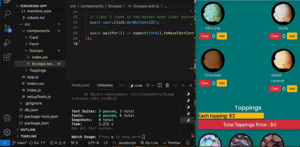

# This is a basic Icecream-App created with React. In this project, I tested each component(scoops, toppings,form etc..) in isolation to ensure they behave as expected by using testing library. It provides utilities for simulating user events (like typing, clicking, etc.) in tests to ensure your components behave as expected.

Please look at the gif and photos for more information.

## SCREEN GIF

## SCREEN VIEW

## Libraries Used:

## axios@^0.27 :

Axios is a promise-based HTTP client for the browser and Node.js. It makes it easy to send HTTP requests and handle responses.

## @testing-library/user-event@14.0 :

The user-event library is part of the Testing Library ecosystem. It provides utilities for simulating user events (like typing, clicking, etc.) in tests to ensure your components behave as expected.

## json-server :

json-server is a simple Node.js tool that allows you to quickly set up a RESTful API using a JSON file as a data source. It's useful for mocking a backend during development.
